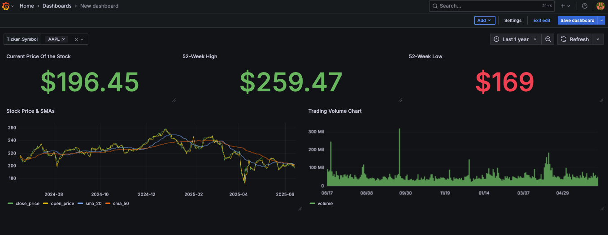

📈 Orchestrated Stock Price Dashboard: Airflow, yfinance, TimescaleDB & Grafana 🚀




This project demonstrates an automated ETL (Extract, Transform, Load) pipeline that fetches daily stock market data, stores it efficiently in a time-series database, and visualizes key metrics and trends on an interactive Grafana dashboard. The entire workflow is orchestrated using Apache Airflow, with all services (Airflow, TimescaleDB, Grafana) containerized using Docker and Docker Compose for a reproducible development environment.

The primary goal was to gain hands-on experience with industry-standard tools and best practices for building scalable and maintainable data pipelines, from data ingestion to visualization.

---

## 🌟 **Key Features & Capabilities**

*   **Automated Data Ingestion:** Stock data (OHLCV) fetched using the `yfinance` library via an Airflow DAG.
*   **Time-Series Optimized Storage:** Data persisted in **TimescaleDB** (PostgreSQL extension), with tables converted to hypertables.
*   **Incremental Data Loading:** Implements an upsert logic (`INSERT ... ON CONFLICT DO NOTHING`) to handle duplicates and ensure data integrity.
*   **Interactive Visualization (Grafana):**
    *   Dynamic ticker selection through dashboard variables.
    *   Price charts displaying Open, Close, and Simple Moving Averages (SMAs).
    *   Trading volume visualization.
    *   Key Performance Indicators (KPIs) like current price and 52-week high/low.
*   **Workflow Orchestration (Apache Airflow):**
    *   Multi-step DAG defining Extract & Load tasks.
    *   `PythonOperator` for custom Python logic within tasks.
    *   XComs for passing data (JSON payloads) between tasks.
*   **Containerized Environment (Docker & Docker Compose):**
    *   All services (Airflow, TimescaleDB, Grafana) run in isolated Docker containers.
    *   Custom Airflow Docker image built with project-specific Python dependencies.
    *   Managed via `docker-compose.yaml` files.
*   **Development Environment (VS Code Dev Containers):**
    *   Includes a `.devcontainer/devcontainer.json` for a consistent, containerized development experience in VS Code.
*   **Configuration & Best Practices:**
    *   Secure management of configurations via environment variables (for Airflow UID).
    *   Standardized Python logging integrated with Airflow task logs.

---

## 🛠️ **Tech Stack**

*   **Orchestration:** Apache Airflow
*   **Containerization:** Docker, Docker Compose
*   **Data Source:** Yahoo Finance (via `yfinance` Python library)
*   **Database:** TimescaleDB (on PostgreSQL)
*   **Visualization:** Grafana
*   **Language:** Python 3.x
*   **Core Libraries:** `apache-airflow`, `yfinance`, `pandas`, `SQLAlchemy`, `psycopg2-binary`, `timescaledb` (Python client), `python-dotenv`
*   **Version Control:** Git & GitHub

---

## 🌊 **Pipeline Architecture & Workflow**


**The pipeline, orchestrated by Airflow, executes these main steps:**

1.  **Fetch Stock Data Task:**
    *   Downloads historical/daily OHLCV data for a predefined list of stock tickers using `yfinance`.
    *   Combines data into a Pandas DataFrame, serializes to JSON, and pushes to Airflow XComs.
2.  **Load Data to TimescaleDB Task:**
    *   Pulls JSON data from XComs and converts it back to a Pandas DataFrame.
    *   Connects to TimescaleDB.
    *   Loads data into a staging table.
    *   Ensures the main target table exists and is a TimescaleDB hypertable (partitioned by time).
    *   Upserts data from staging to the main hypertable, handling duplicates.
3.  **Grafana Visualization:**
    *   Grafana connects to TimescaleDB as a data source.
    *   Pre-configured dashboards (via imported JSON model) query the hypertable to display stock data.

---

## 🚀 **Local Setup & Execution Guide**

### Prerequisites
*   Docker Desktop: Installed and running.
*   Git: Installed.
*   VS Code (Recommended) with the "Dev Containers" extension (`ms-vscode-remote.remote-containers`).

### 1. Clone Repository
```bash
git clone https://github.com/rameshmkumar/airflow_stocks_dashboard
cd airflow_stocks_dashboard
```

### 2. Configure Environment

**Airflow docker-compose.yaml:** Ensure the official Airflow docker-compose.yaml (e.g., named docker-compose-airflow.yaml) is in the project root. Refer to Airflow docs for the download command if not included.

**Data Services docker-compose-data-services.yaml:** Ensure this file (defining TimescaleDB & Grafana) is in the project root.

**Airflow Directories:** Create if they don't exist from cloning:
```bash
mkdir -p ./dags ./logs ./plugins ./config
```

**Airflow UID:** Create a .env file in the project root for Docker file permissions:
```bash
echo -e "AIRFLOW_UID=$(id -u)" > .env
```

**Python Dependencies:** Ensure `requirements-airflow.txt` and `Dockerfile` 

### 3. Launch Development Environment (VS Code Dev Container - Recommended)
Open the project folder in VS Code.  
When prompted, click "Reopen in Container".  
This will use the `.devcontainer/devcontainer.json` to build/start all services (Airflow, TimescaleDB, Grafana) via Docker Compose.  
The Airflow metadata database will be initialized on the first proper run of `airflow-init` (managed by the dev container or manual run below).

### 4. Manual Startup (If not using VS Code Dev Container for initial setup)
```bash
# Build custom Airflow images (if not done by dev container)
docker-compose -f [your-airflow-compose-file.yaml] build

# Initialize Airflow metadata database (first time only)
docker-compose -f [your-airflow-compose-file.yaml] up airflow-init

# Start all services
docker-compose -f [your-airflow-compose-file.yaml] -f docker-compose-data-services.yaml up -d
```

### 5. Access Services & Run Pipeline
**Airflow UI:** http://localhost:8080 (Login: airflow/airflow)  
Locate the `stock_data_ingestion_pipeline_vX` DAG. Unpause and trigger it.

**Grafana UI:** http://localhost:3000 (Login: admin/admin or as configured)  
**Add TimescaleDB Data Source:**
- Host: `timescaledb_stocks:5432` (service name, internal Docker port)  
- Database: `stockdb`, User: `stockuser`, Password: `stockpassword`  
- SSL: disable, Enable "TimescaleDB" toggle. Save & Test.

**Import Grafana Dashboard:**
- Create (+) -> Import dashboard -> Upload JSON file.  
- Select `grafana_dashboards/stock_tracker_dashboard.json` from this repo.  
- Choose your TimescaleDB data source when prompted. Click "Import".

### 6. Verify
- Check Airflow task logs.  
- Query the `stock_prices_historical` table in TimescaleDB (e.g., via DBeaver on localhost:5435).  
- Interact with the Grafana dashboard.

---

## 💡 **Business Value & Insights Provided**

This automated pipeline provides a dynamic and up-to-date view of stock market performance. It enables:
- Tracking historical price and volume trends.
- Identifying key support/resistance levels using SMAs.
- Monitoring important KPIs like current price and 52-week performance.

---

## 🌟 **Future Enhancements**

- Parameterize stock tickers and historical period using Airflow Variables.
- Integrate data quality checks (e.g., for missing data, price anomalies).
- Add more advanced technical indicators to Grafana (RSI, MACD).
- Explore scheduling options beyond @daily for more frequent updates.
- Implement alerting for pipeline failures or significant market movements.

---

## 👤 **Contact**

Name: Ramesh Manthirakumar

LinkedIn: https://www.linkedin.com/in/ramesh-manthirakumar-a49191199/

